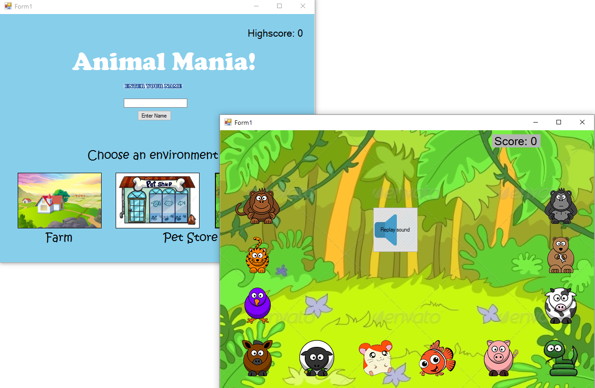

# Matching Animal Sound
As part of a high school assignment, the team has created a game for our teacher's new born baby. The goal of this game is to teach babies to differenciate different animals from its sound based on different ecosystem.

## Usage
Download this repository and find the application in the bin/debug folder. Run the executable to play the game

## Authors and Acknowledgment
This project is co-developed with Angela Chen and Mitchell Tai

## Contributing
This repository is not actively maintained but feel free to fork and make modification.
